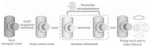
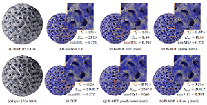
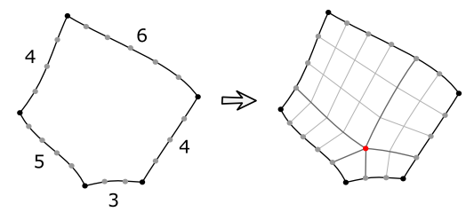
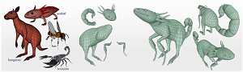
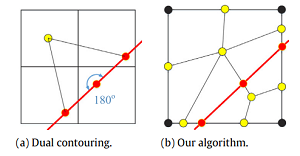
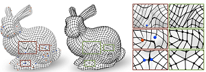
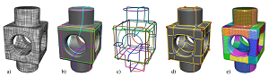
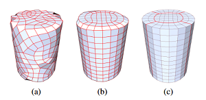

# A Survey on Work Related to Quad Meshing

Here is a list of related work on quad meshing that I have collected and complied.
I'm still working on it, so some of the information may not be complete.
I will update this list on a regular basis.

It is worth noting that the work of hex meshing includes the content of quad meshing to some extent, but here we try not to include the work of hex meshing.

The emoji :white_check_mark: after the `[code]` indicates that this code has been verified by me to be valid.

:clap: If you have any suggestions for improvements, please raise an issue or contact me.

# :page_with_curl: Papers

<table> 
<!-- ---------------------------------------------------------------------- -->
<tr>
<td>

<td>

**Robust motorcycle graph construction and simplification for semi-structured quad mesh generation**

Yanchao Yu, Ni Li, Guanghong Gong

April 2025, Computers & Graphics
<td>

- [[Paper]](https://www.sciencedirect.com/science/article/pii/S0097849325000123)
<!-- ---------------------------------------------------------------------- -->
<tr>
<td>

<td>

**RFF-meshing: a parallel and anisotropic quad-dominant mesh generation framework based on Riemann frame field**

Long Qi, Jingying Qiu, Gang Xu, Yang Liu, Jiamin Xu, Renshu Gu, Fengshun Lu, Yufei Pang

24 December 2024, Engineering with Computers
<td>

- [[Paper]](RFF-meshing-a-parallel-and-anisotropic-quad-dominant-mesh-generation-framework-based-on-Riemann-frame-field)
<!-- ---------------------------------------------------------------------- -->
<tr>
<td>

<td>

**Enhanced block-structured quadrilateral mesh generation: integrating cross-field and distance field for optimal domain decomposition**

Yuanxing Lv, Beiyan Jia, Yuxiang Yan, Cecil G. Armstrong, Trevor T. Robinson, Liang Sun

28 November 2024, Engineering with Computers
<td>

- [[Paper]](https://link.springer.com/article/10.1007/s00366-024-02084-x)
<!-- ---------------------------------------------------------------------- -->
<tr>
<td>

<td>

**Quad mesh mechanisms**

Caigui Jiang, Dmitry Lyakhov, Florian Rist, Helmut Pottmann, Johannes Wallner

19 November 2024, TOG
<td>

- [[Paper]](https://dl.acm.org/doi/10.1145/3687939)
<!-- ---------------------------------------------------------------------- -->
<tr>
<td>

<td>

**Similarity-driven topology finding of surface patterns for structural design**

R. Oval, R. Mesnil, T. Van Mele, O. Baverel, P. Block

November 2024, CAD
<td>

- [[Paper]](https://www.sciencedirect.com/science/article/pii/S0010448524000782)
<!-- ---------------------------------------------------------------------- -->
<tr>
<td>

<td>

**Anisotropy and Cross Fields**

Lance Simons, Amenta Nina

05 August 2024, CGF
<td>

- [[Paper]](https://onlinelibrary.wiley.com/doi/abs/10.1111/cgf.15132)
<!-- ---------------------------------------------------------------------- -->
<tr>
<td>

<td>

**Integer-Sheet-Pump Quantization for Hexahedral Meshing**

H. Brückler, D. Bommes, M. Campen

31 July 2024, CGF
<td>

- [[Paper]](https://onlinelibrary.wiley.com/doi/full/10.1111/cgf.15131)
<!-- ---------------------------------------------------------------------- -->
<tr>
<td>

<td>

**Capacitive Touch Sensing on General 3D Surfaces**

Gianpaolo Palma, Narges Pourjafarian, Jürgen Steimle, [Paolo Cignoni](https://vcg.isti.cnr.it/~cignoni/)

19 July 2024, TOG
<td>

- [[Paper]](https://dl.acm.org/doi/10.1145/3658185)
<!-- ---------------------------------------------------------------------- -->
<tr>
<td>

<td>

**An Intrinsic Vector Heat Network**

Alexander Gao, Maurice Chu, Mubbasir Kapadia, Ming C. Lin, Hsueh-Ti Derek Liu

18 July 2024, arXiv
<td>

- [[Paper]](https://arxiv.org/abs/2406.09648)
<!-- ---------------------------------------------------------------------- -->
<tr>
<td>

<td>

**High-quality quad-mesh generation for self-intersecting parametric surfaces**

Haolei Nan, Gang Xu, Haiyan Wu, Renshu Gu, Jinlan Xu, Yang Liu

03 July 2024, Preprint
<td>

- [[Paper]](https://www.researchsquare.com/article/rs-4599197/v1)
<!-- ---------------------------------------------------------------------- -->
<tr>
<td>

<td>

**Feature-preserving quadrilateral mesh Boolean operation with cross-field guided layout blending**

Weiwei Zheng, Haiyan Wu, Gang Xu, Ran Ling, Renshu Gu

June 2024, CAGD
<td>

- [[Paper]](https://www.sciencedirect.com/science/article/pii/S016783962400058X)
<!-- ---------------------------------------------------------------------- -->
<tr>
<td>

<td>

**Quadrilateral surface mesh generation with improved quality by combination of triangles**

Jingchen Gao, Zhoufang Xiao, Chenhao Xu, Shuwei Shen, Gang Xu

27 May 2024, International Journal for Numerical Methods in Engineering
<td>

- [[Paper]](https://onlinelibrary.wiley.com/doi/full/10.1002/nme.7539)
<!-- ---------------------------------------------------------------------- -->
<tr>
<td>

<td>

**Block-Structured Quad Meshing for Supersonic Flow Simulations**

Claire Roche, Jérôme Breil, Thierry Hocquellet, Franck Ledoux

21 March 2024, SIAM International Meshing Roundtable 2023
<td>

- [[Slide]](https://link.springer.com/chapter/10.1007/978-3-031-40594-5_7)
<!-- ---------------------------------------------------------------------- -->
<tr>
<td>

<td>

**Bending-Reinforced Grid Shells for Free-form Architectural Surfaces**

Francesco Laccone, [Nico Pietroni](https://www.nicopietroni.com/), [Paolo Cignoni](https://vcg.isti.cnr.it/~cignoni/), Luigi Malomo

March 2024, CAD
<td>

- [[Paper]](https://www.sciencedirect.com/science/article/pii/S0010448523002026)
<!-- ---------------------------------------------------------------------- -->
<tr>
<td>

<td>

**Adaptive Spline Surface Fitting With Arbitrary Topological Control Mesh**

Yi-Bo Kou, Yi-Fei Feng, Li-Yong Shen, Xin Li, Chun-Ming Yuan

02 February 2024, TVCG
<td>

- [[Paper]](https://ieeexplore.ieee.org/abstract/document/10418985)
<!-- ---------------------------------------------------------------------- -->
<tr>
<td>

<td>

**Champs de repères 2,5D pour la génération de maillages hexaédriques**

Yoann Coudert

2024, Hal
<td>

- [[Paper]](https://hal.science/tel-04907393/)
<!-- ---------------------------------------------------------------------- -->
<tr>
<td>

<td>

**Optimal Surface Quadrilateral Mesh Generation**

Zhou Zhao, Siyu Fang, Na Lei, Yuanpeng Liu, Yiming Zhu, Chander Sadasivan, Apostolos Tassiopoulos, Shikui Chen, Xianfeng Gu

2024, Proceedings of the 2024 International Meshing Roundtable (IMR)
<td>

- [[Paper]](https://epubs.siam.org/doi/abs/10.1137/1.9781611978001.2)
<!-- ---------------------------------------------------------------------- -->
<tr>
<td>

<td>

**QUADify: Extracting Meshes with Pixel-level Details and Materials from Images**

Maximilian Frühauf, Hayko Riemenschneider, Markus Gross, Christopher Schroers

2024, CVPR
<td>

- [[Paper]](https://openaccess.thecvf.com/content/CVPR2024/html/Fruhauf_QUADify_Extracting_Meshes_with_Pixel-level_Details_and_Materials_from_Images_CVPR_2024_paper.html)
<!-- ---------------------------------------------------------------------- -->
<tr>
<td>

<td>

**Quad Mesh Quantization Without a T-Mesh**

Yoann Coudert-Osmont, David Desobry, Martin Heistermann, [David Bommes](https://www.graphics.rwth-aachen.de/person/6/), Nicolas Ray, Dmitry Sokolov

17 September 2023, CGF
<td>

- [[Paper]](https://onlinelibrary.wiley.com/doi/abs/10.1111/cgf.14928)
<!-- ---------------------------------------------------------------------- -->
<tr>
<td>

<td>

**Min-Deviation-Flow in Bi-directed Graphs for T-Mesh Quantization**

Martin Heistermann, Jethro Warnett, [David Bommes](https://www.graphics.rwth-aachen.de/person/6/)

26 July 2023, TOG
<td>

- [[Paper]](https://dl.acm.org/doi/10.1145/3592437)
<!-- ---------------------------------------------------------------------- -->
<tr>
<td>

<td>

**Towards a robust and portable pipeline for quad meshing: Topological initialization of injective integer grid maps**

Marco Livesu

May 2023, CGF (Special Section on STAG 2022)
<td>

- [[Paper]](https://www.sciencedirect.com/science/article/pii/S0097849323000341)
<!-- ---------------------------------------------------------------------- -->
<tr>
<td>

<td>

**What's the Situation With Intelligent Mesh Generation: A Survey and Perspectives**

Na Lei, Zezeng Li, Zebin Xu, Ying Li, Xianfeng Gu

01 June 2023, TVCG
<td>

- [[Paper]](https://ieeexplore.ieee.org/abstract/document/10141677)
<!-- ---------------------------------------------------------------------- -->
<tr>
<td>

<td>

**Closed-form Quadrangulation of n-Sided Patches**

[Marco Tarini](https://tarini.di.unimi.it/)

October 2022, Computers & Graphics
<td>

- [[Paper]](https://www.sciencedirect.com/science/article/pii/S0097849322001170)
<!-- ---------------------------------------------------------------------- -->
<tr>
<td>

<td>

**Face Extrusion Quad Meshes**

Karran Pandey, J. Andreas Bærentzen, Karan Singh

24 July 2022, SIGGRAPH 2022
<td>

- [[Paper]](https://dl.acm.org/doi/abs/10.1145/3528233.3530754)
<!-- ---------------------------------------------------------------------- -->
<tr>
<td>

<td>

**Reliable feature-line driven quad-remeshing**

[Nico Pietroni](https://www.nicopietroni.com/), [Stefano Nuvoli](https://github.com/stefanonuvoli), Thomas Alderighi, [Paolo Cignoni](https://vcg.isti.cnr.it/~cignoni/), [Marco Tarini](https://tarini.di.unimi.it/)

19 July 2021, TOG (SIGGRAPH 2021)
<td>

- [[Paper]](https://dl.acm.org/doi/pdf/10.1145/3450626.3459941)
- [[Project Page]](https://www.quadmesh.cloud/)
- [[Code]](https://github.com/nicopietroni/quadwild)
<!-- ---------------------------------------------------------------------- -->
<tr>
<td>

<td>

**Quasi-structured quadrilateral meshing in Gmsh -- a robust pipeline for complex CAD models**

Maxence Reberol, Christos Georgiadis, Jean-François Remacle

08 Mar 2021, arXiv
<td>

- [[Paper]](https://arxiv.org/abs/2103.04652)
<!-- ---------------------------------------------------------------------- -->
<tr>
<td>

<td>

**Semi-global Quad Mesh Structure Simplification via Separatrix Operations**

Kaoji Xu, Muhammad Naeem Akram, Guoning Chen

17 November 2020 (SIGGRAPH Asia 2020 Technical Communications)
<td>

- [[Paper]](https://dl.acm.org/doi/10.1145/3410700.3425436)
<!-- ---------------------------------------------------------------------- -->
<tr>
<td>

<td>

**Cost Minimizing Local Anisotropic Quad Mesh Refinement**

Max Lyon, [David Bommes](https://www.graphics.rwth-aachen.de/person/6/), and Leif Kobbelt

12 August 2020, CGF
<td>

- [[Paper]](https://onlinelibrary.wiley.com/doi/full/10.1111/cgf.14076)
<!-- ---------------------------------------------------------------------- -->
<tr>
<td>

<td>

**QuadMixer: layout preserving blending of quadrilateral meshes**

[Stefano Nuvoli](https://github.com/stefanonuvoli), Alex Hernandez, Claudio Esperança, [Riccardo Scateni](https://web.unica.it/unica/page/it/riccardo_scateni), [Paolo Cignoni](https://vcg.isti.cnr.it/~cignoni/), [Nico Pietroni](https://profiles.uts.edu.au/Nico.Pietroni)

08 November 2019, TOG (SIGGRAPH Asia 2019)
<td>

- [[Paper]](https://dl.acm.org/doi/10.1145/3355089.3356542)
- [[Code]](https://github.com/stefanonuvoli/quadmixer)
<!-- ---------------------------------------------------------------------- -->
<tr>
<td>

<td>

**Parametrization quantization with free boundaries for trimmed quad meshing**

[Max Lyon](https://www.graphics.rwth-aachen.de/person/99/), [Marcel Campen](https://graphics.cs.uos.de/), [David Bommes](https://www.graphics.rwth-aachen.de/person/6/), [Leif Kobbelt](https://www.graphics.rwth-aachen.de/person/3/)

12 July 2019, TOG (SIGGRAPH 2019)
<td>

- [[Paper]](https://dl.acm.org/doi/10.1145/3306346.3323019)
<!-- ---------------------------------------------------------------------- -->
<tr>
<td>

<td>

**Towards fully regular quad mesh generation**

Julia Docampo-Sanchez, Robert Haimes

06 Jan 2019, AIAA
<td>

- [[Paper]](https://arc.aiaa.org/doi/abs/10.2514/6.2019-1988)
<!-- ---------------------------------------------------------------------- -->
<tr>
<td>

<td>

**Generalized motorcycle graphs for imperfect quad-dominant meshes**

[Nico Schertler](https://nschertler.github.io/), [Daniele Panozzo](https://cims.nyu.edu/gcl/daniele.html), Stefan Gumhold, [Marco Tarini](https://tarini.di.unimi.it/)

30 July 2018, TOG
<td>

- [[Paper]](https://dl.acm.org/doi/10.1145/3197517.3201389)
- [[Code]](https://github.com/NSchertler/GeneralizedMotorcycleGraph)
<!-- ---------------------------------------------------------------------- -->
<tr>
<td>

<td>

**All-quad meshing without cleanup**

Ahmad A. Rushdi, Scott A. Mitchell, Ahmed H. Mahmoud, Chandrajit C. Bajaj, Mohamed S. Ebeida

April 2017, CAD
<td>

- [[Paper]](https://www.sciencedirect.com/science/article/pii/S001044851630080X)
<!-- ---------------------------------------------------------------------- -->
<tr>
<td>

<td>

**Interactively controlled quad remeshing of high resolution 3D models**

[Hans-Christian Ebke](https://www.graphics.rwth-aachen.de/person/10/), [Patrick Schmidt](https://patr-schm.github.io/), [Marcel Campen](https://graphics.cs.uos.de/), [Leif Kobbelt](https://www.graphics.rwth-aachen.de/person/3/)

05 December 2016, TOG
<td>

- [[Paper]](https://dl.acm.org/doi/10.1145/2980179.2982413)
<!-- ---------------------------------------------------------------------- -->
<tr>
<td>

<td>

**A PDE Based Approach to Multidomain Partitioning and Quadrilateral Meshing**

Nicolas Kowalski, Franck Ledoux, Pascal Frey

26 Feb 2016, Proceedings of the 21st International Meshing Roundtable
<td>

- [[Paper]](https://link.springer.com/chapter/10.1007/978-3-642-33573-0_9)
<!-- ---------------------------------------------------------------------- -->
<tr>
<td>

<td>

**Level-of-detail quad meshing**

Hans-Christian Ebke, Marcel Campen, [David Bommes](https://www.graphics.rwth-aachen.de/person/6/), Leif Kobbelt

19 November 2014, TOG
<td>

- [[Paper]](https://dl.acm.org/doi/abs/10.1145/2661229.2661240)
<!-- ---------------------------------------------------------------------- -->
<tr>
<td>

<td>

**QEx: robust quad mesh extraction**

Hans-Christian Ebke, [David Bommes](https://www.graphics.rwth-aachen.de/person/6/), Marcel Campen, Leif Kobbelt

01 November 2013, TOG
<td>

- [[Paper]](https://dl.acm.org/doi/abs/10.1145/2508363.2508372)
<!-- ---------------------------------------------------------------------- -->
<tr>
<td>

<td>

**Integer-grid maps for reliable quad meshing**

[David Bommes](https://www.graphics.rwth-aachen.de/person/6/), Marcel Campen, Hans-Christian Ebke, Pierre Alliez, Leif Kobbelt

21 July 2013, TOG
<td>

- [[Paper]](https://dl.acm.org/doi/abs/10.1145/2461912.2462014)
<!-- ---------------------------------------------------------------------- -->
<tr>
<td>

<td>

**Dual loops meshing: quality quad layouts on manifolds**

Marcel Campen, [David Bommes](https://www.graphics.rwth-aachen.de/person/6/), Leif Kobbelt

01 July 2012
<td>

- [[Paper]](https://dl.acm.org/doi/abs/10.1145/2185520.2185606)
<!-- ---------------------------------------------------------------------- -->
<tr>
<td>

<td>

**Quad-Mesh Generation and Processing: A Survey**

[David Bommes](https://www.graphics.rwth-aachen.de/person/6/), [Bruno Lévy](https://brunolevy.github.io/), [Nico Pietroni](https://www.nicopietroni.com/), [Enrico Puppo](https://person.dibris.unige.it/puppo-enrico/), [Claudio Silva](https://engineering.nyu.edu/faculty/claudio-silva), [Marco Tarini](https://tarini.di.unimi.it/), [Denis Zorin](https://cims.nyu.edu/gcl/denis.html)

01 January 2012, CGF (Eurographics 2012-State of the Art Reports)
<td>

- [[Paper]](https://dl.acm.org/doi/abs/10.1111/cgf.12014)
<!-- ---------------------------------------------------------------------- -->
<tr>
<td>

<td>

**Global Structure Optimization of Quadrilateral Meshes**

[David Bommes](https://www.graphics.rwth-aachen.de/person/6/), Timm Lempfer, Leif Kobbelt

28 April 2011
<td>

- [[Paper]](https://onlinelibrary.wiley.com/doi/full/10.1111/j.1467-8659.2011.01868.x)
<!-- ---------------------------------------------------------------------- -->
<tr>
<td>

<td>

**Lp Centroidal Voronoi Tessellation and its applications**

[Bruno Lévy](https://brunolevy.github.io/), [Yang Liu](https://xueyuhanlang.github.io/)

26 July 2010, TOG
<td>

- [[Paper]](https://dl.acm.org/doi/abs/10.1145/1778765.1778856)
- [[Code]](https://app.box.com/s/vh9mz9eody9xuxj7xtp2f19d8d7gya97):white_check_mark:
<!-- ---------------------------------------------------------------------- -->
<tr>
<td>

<td>

**Practical quad mesh simplification**

[Marco Tarini](https://tarini.di.unimi.it/), [Nico Pietroni](https://www.nicopietroni.com/), [Paolo Cignoni](https://vcg.isti.cnr.it/~cignoni/), Daniele Panozzo, Enrico Puppo

07 June 2010, CGF
<td>

- [[Paper]](https://onlinelibrary.wiley.com/doi/full/10.1111/j.1467-8659.2009.01610.x)
<!-- ---------------------------------------------------------------------- -->
<tr>
<td>

<td>

**Quadrilateral mesh simplification**

Joel Daniels, Cláudio T. Silva, Jason Shepherd, Elaine Cohen

01 December 2008, TOG
<td>

- [[Paper]](https://dl.acm.org/doi/abs/10.1145/1409060.1409101)
<!-- ---------------------------------------------------------------------- -->
<tr>
<td>

<td>

**A Robust Two-Step Procedure for Quad-Dominant Remeshing**

Martin Marinov, Leif Kobbelt

07 December 2006, CGF
<td>

- [[Paper]](https://onlinelibrary.wiley.com/doi/full/10.1111/j.1467-8659.2006.00973.x)
<!-- ---------------------------------------------------------------------- -->
<tr>
<td>

<td>

**Adaptive and quality quadrilateral/hexahedral meshing from volumetric data**

Yongjie Zhang, Chandrajit Bajaj

01 February 2006, CMAME
<td>

- [[Paper]](https://www.sciencedirect.com/science/article/pii/S0045782505001374)
<!-- ---------------------------------------------------------------------- -->
<tr>
<td>

<td>

**Quadrilateral Meshing with Directionality Control through the Packing of Square Cells**

Kenji Shimada, Jia-huei Liao, Takayuki Itoh

May 2000
<td>

- [[Paper]](https://www.researchgate.net/publication/2619142_Quadrilateral_Meshing_with_Directionality_Control_through_the_Packing_of_Square_Cells)
<!-- ---------------------------------------------------------------------- -->
<tr>
<td>

<td>

**Q-Morph: an indirect approach to advancing front quad meshing**

S. J. Owen, M. L. Staten, S. A. Canann, S. Saigal

17 March 1999, International Journal for Numerical Methods in Engineering
<td>

- [[Paper]](https://onlinelibrary.wiley.com/doi/abs/10.1002/(SICI)1097-0207(19990330)44:9%3C1317::AID-NME532%3E3.0.CO;2-N)
<!-- ---------------------------------------------------------------------- -->
</table>

# :hammer: Projects

# :floppy_disk: Softwares