# A Survey on Work Related to Quad Meshing

Here is a list of related work on **quad meshing** that I have collected and complied.
I'm still working on it, so some of the information may not be complete.
I will update this list on a regular basis.

It is worth noting that the work of **hex meshing** includes the content of quad meshing to some extent, but here we try not to include the work of hex meshing.

The emoji :white_check_mark: after the `[code]` indicates that this code has been verified by me to be valid.

:clap: If you have any suggestions for improvements, please raise an issue or contact me.

# :page_with_curl: Papers

## Quad Meshing
<!-- %%%%%%%%%%%%%%%%%%%%%%%%%%%%%%%%%%%%%%%%%%%%%%%%%%%%%%%%%%%%%%%%%%%%%%%%%%%%%%%%% -->
<!-- %%%%%%%%%%%%%%%%%%%%%%%%%%%%%%%%%%%%%%%%%%%%%%%%%%%%%%%%%%%%%%%%%%%%%%%%%%%%%%%%% -->
<!-- %%%%%%%%%%%%%%%%%%%%%%%%%%%%%%%%%%%%%%%%%%%%%%%%%%%%%%%%%%%%%%%%%%%%%%%%%%%%%%%%% -->
### :red_circle: Coarse-Layout based methods
#### Conforming layouts methods
<table>
<!-- ---------------------------------------------------------------------- -->
<tr><td><td>

**Optimal base complexes for quadrilateral meshes**

Faniry H. Razafindrazaka, Konrad Polthier

March–April 2017, CAGD

[[doi]](https://www.sciencedirect.com/science/article/pii/S0167839617300286)
<!-- ---------------------------------------------------------------------- -->
<tr><td>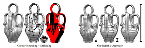<td>

**Integer-grid maps for reliable quad meshing**

[David Bommes], [Marcel Campen], [Hans-Christian Ebke], Pierre Alliez, [Leif Kobbelt]

21 July 2013, TOG

[[doi]](https://dl.acm.org/doi/abs/10.1145/2461912.2462014) [[additional material]](https://www-sop.inria.fr/members/David.Bommes/publications/IGM_additional_material.zip)
<!-- ---------------------------------------------------------------------- -->
<tr><td><td>

**Dual loops meshing: quality quad layouts on manifolds**

[Marcel Campen], [David Bommes], [Leif Kobbelt]

01 July 2012, TOG

[[doi]](https://dl.acm.org/doi/abs/10.1145/2185520.2185606)
<!-- ---------------------------------------------------------------------- -->
<tr><td><td>

**Simple quad domains for field aligned mesh parametrization**

[Marco Tarini], [Enrico Puppo], [Daniele Panozzo], [Nico Pietroni], [Paolo Cignoni]

12 December 2011, SIGGRAPH Asia

[[doi]](https://dl.acm.org/doi/abs/10.1145/2024156.2024176)
<!-- ---------------------------------------------------------------------- -->
<tr><td><td>

**Global Structure Optimization of Quadrilateral Meshes**

[David Bommes], Timm Lempfer, [Leif Kobbelt]

28 April 2011, CGF

[[doi]](https://onlinelibrary.wiley.com/doi/full/10.1111/j.1467-8659.2011.01868.x) [[additional material]](https://www-sop.inria.fr/members/David.Bommes/publications/global_structure.zip)
<!-- ---------------------------------------------------------------------- -->
<tr><td><td>

**Automatic Construction of Quad-Based Subdivision Surfaces Using Fitmaps**

[Daniele Panozzo], [Enrico Puppo], [Marco Tarini], [Nico Pietroni], [Paolo Cignoni]

04 February 2011, TVCG

[[doi]](https://ieeexplore.ieee.org/abstract/document/5708143)
</table>
<!-- %%%%%%%%%%%%%%%%%%%%%%%%%%%%%%%%%%%%%%%%%%%%%%%%%%%%%%%%%%%%%%%%%%%%%%%%%%%%%%%%% -->
<!-- %%%%%%%%%%%%%%%%%%%%%%%%%%%%%%%%%%%%%%%%%%%%%%%%%%%%%%%%%%%%%%%%%%%%%%%%%%%%%%%%% -->
<!-- %%%%%%%%%%%%%%%%%%%%%%%%%%%%%%%%%%%%%%%%%%%%%%%%%%%%%%%%%%%%%%%%%%%%%%%%%%%%%%%%% -->

#### Non-conforming layouts methods
<table>
<!-- ---------------------------------------------------------------------- -->
<tr><td><td>

**Generalized motorcycle graphs for imperfect quad-dominant meshes**

[Nico Schertler], [Daniele Panozzo], Stefan Gumhold, [Marco Tarini]

30 July 2018, TOG

[[doi]](https://dl.acm.org/doi/10.1145/3197517.3201389) [[code]](https://github.com/NSchertler/GeneralizedMotorcycleGraph)
<!-- ---------------------------------------------------------------------- -->
<tr><td><td>

**Extraction of the Quad Layout of a Triangle Mesh Guided by Its Curve Skeleton**

Francesco Usai, [Marco Livesu], [Enrico Puppo], [Marco Tarini], [Riccardo Scateni]

29 December 2015, TOG

[[doi]](https://dl.acm.org/doi/abs/10.1145/2809785) [[project]](http://pers.ge.imati.cnr.it/livesu/papers/ULPTS15/ULPTS15.html)
<!-- ---------------------------------------------------------------------- -->
<tr><td><td>

**Controlled-distortion constrained global parametrization**

Ashish Myles, [Denis Zorin]

21 July 2013, TOG

[[doi]](https://dl.acm.org/doi/abs/10.1145/2461912.2461970)
<!-- ---------------------------------------------------------------------- -->
<tr><td><td>

**Robust field-aligned global parametrization**

Ashish Myles, [Nico Pietroni], [Denis Zorin]

27 July 2014, TOG

[[doi]](https://dl.acm.org/doi/10.1145/2601097.2601154) [[project]](https://vcg.isti.cnr.it/publication/2014/MPZ14/)
</table>
<!-- %%%%%%%%%%%%%%%%%%%%%%%%%%%%%%%%%%%%%%%%%%%%%%%%%%%%%%%%%%%%%%%%%%%%%%%%%%%%%%%%% -->
<!-- %%%%%%%%%%%%%%%%%%%%%%%%%%%%%%%%%%%%%%%%%%%%%%%%%%%%%%%%%%%%%%%%%%%%%%%%%%%%%%%%% -->
<!-- %%%%%%%%%%%%%%%%%%%%%%%%%%%%%%%%%%%%%%%%%%%%%%%%%%%%%%%%%%%%%%%%%%%%%%%%%%%%%%%%% -->

#### Non-rectangular layouts methods
<table>
<!-- ---------------------------------------------------------------------- -->
<tr><td><td>

**Reliable feature-line driven quad-remeshing**

[Nico Pietroni], [Stefano Nuvoli], Thomas Alderighi, [Paolo Cignoni], [Marco Tarini]

19 July 2021, TOG (SIGGRAPH 2021)

[[doi]](https://dl.acm.org/doi/10.1145/3450626.3459941) [[pdf]](https://dl.acm.org/doi/pdf/10.1145/3450626.3459941) [[project]](https://www.quadmesh.cloud/) [[code]](https://github.com/nicopietroni/quadwild):white_check_mark:
</table>
<!-- --------------------------------------------------------------------------------- -->
<!-- --------------------------------------------------------------------------------- -->
<!-- --------------------------------------------------------------------------------- -->

<!-- --------------------------------------------------------------------------------- -->
<!-- --------------------------------------------------------------------------------- -->
<!-- --------------------------------------------------------------------------------- -->

### :red_circle: Morse-based methods
<table>
<!-- ---------------------------------------------------------------------- -->
<tr>
<td>

<td>

**Quadrangulation through morse-parameterization hybridization**

[Xianzhong Fang], [Hujun Bao], Yiying Tong, Mathieu Desbrun, [Jin Huang]

30 July 2018, TOG

[[doi]](https://dl.acm.org/doi/abs/10.1145/3197517.3201354) [[bin]](http://www.cad.zju.edu.cn/home/hj/18/hybrid_quad_binary_Mint19_V20180731.7z) [[supplementary material]](http://www.cad.zju.edu.cn/home/hj/18/hybrid_quad_dataset_test.pdf) [[data]](http://www.cad.zju.edu.cn/home/hj/18/hybrid_quad.zip)
<!-- ---------------------------------------------------------------------- -->
<tr><td><td>

**Spectral Quadrangulation with Feature Curve Alignment and Element Size Control**

Ruotian Ling, [Jin Huang], Bert Jüttler, Feng Sun, [Hujun Bao], [Wenping Wang]

29 December 2014, TOG

[[doi]](https://dl.acm.org/doi/abs/10.1145/2653476)
<!-- ---------------------------------------------------------------------- -->
<tr><td><td>

**A wave-based anisotropic quadrangulation method**

Muyang Zhang, [Jin Huang], Xinguo Liu, [Hujun Bao]

26 July 2010, SIGGRAPH

[[doi]](https://dl.acm.org/doi/abs/10.1145/1833349.1778855)
<!-- ---------------------------------------------------------------------- -->
<tr><td><td>

**Spectral quadrangulation with orientation and alignment control**

[Jin Huang], Muyang Zhang, Jin Ma, Xinguo Liu, [Leif Kobbelt], [Hujun Bao]

01 December 2008, SIGGRAPH Asia

[[doi]](https://dl.acm.org/doi/abs/10.1145/1457515.1409100)
<!-- ---------------------------------------------------------------------- -->
<tr><td><td>

**Spectral surface quadrangulation**

Shen Dong, Peer-Timo Bremer, Michael Garland, Valerio Pascucci, John C. Hart

01 July 2006

[[doi]](https://dl.acm.org/doi/abs/10.1145/1179352.1141993)
</table>

<!-- %%%%%%%%%%%%%%%%%%%%%%%%%%%%%%%%%%%%%%%%%%%%%%%%%%%%%%%%%%%%%%%%%%%%%%%%%%%%%%%%% -->
<!-- %%%%%%%%%%%%%%%%%%%%%%%%%%%%%%%%%%%%%%%%%%%%%%%%%%%%%%%%%%%%%%%%%%%%%%%%%%%%%%%%% -->
<!-- %%%%%%%%%%%%%%%%%%%%%%%%%%%%%%%%%%%%%%%%%%%%%%%%%%%%%%%%%%%%%%%%%%%%%%%%%%%%%%%%% -->
### :red_circle: Tri-to-Quad
<table>
<!-- ---------------------------------------------------------------------- -->
<tr><td><td>

**Quadrilateral surface mesh generation with improved quality by combination of triangles**

Jingchen Gao, Zhoufang Xiao, Chenhao Xu, Shuwei Shen, [Gang Xu]

27 May 2024, International Journal for Numerical Methods in Engineering

[[doi]](https://onlinelibrary.wiley.com/doi/full/10.1002/nme.7539)
<!-- ---------------------------------------------------------------------- -->
<tr><td>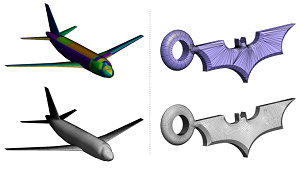<td>

**Indirect all-quadrilateral meshing based on bipartite topological labeling**

Christos Georgiadis, Maxence Reberol, Jean-François Remacle

07 October 2022, Engineering with Computers

[[doi]](https://link.springer.com/article/10.1007/s00366-022-01740-4) [[pdf]](https://www.researchsquare.com/article/rs-1272019/v1.pdf)
<!-- ---------------------------------------------------------------------- -->
<tr><td><td>

**Quasi-structured quadrilateral meshing in Gmsh -- a robust pipeline for complex CAD models**

[Maxence Reberol], Christos Georgiadis, Jean-François Remacle

08 Mar 2021, arXiv

[[doi]](https://arxiv.org/abs/2103.04652) [[video]](https://www.youtube.com/watch?v=OY6U3EyCq0o) [[available in Gmsh 4.8.1+]](https://mxncr.github.io)
<!-- ---------------------------------------------------------------------- -->
<tr><td><td>

**Robust metric aligned quad-dominant meshing using Lp centroidal Voronoi tessellation**

Dirk Ekelschot, Marco Ceze, Anirban Garai, Scott M. Murman

07 Jan 2018, AIAA

[[doi]](https://doi.org/10.2514/6.2018-1501)
<!-- ---------------------------------------------------------------------- -->
<tr><td><td>

**Quad Mesh Generation via Field-Aligned Centroidal Voronoi Tessellation**

[Xingyi Du], [Dong-Ming Yan], Juntao Ye, Hui Zhang

2018, Journal of Computer-Aided Design & Computer Graphics

[[doi]](https://www.jcad.cn/en/article/doi/10.3724/SP.J.1089.2017.16689) [[project]](https://duxingyi-charles.github.io/publication/quad-mesh-generation-via-field-aligned-centroidal-voronoi-tessellation/)
<!-- ---------------------------------------------------------------------- -->
<tr><td>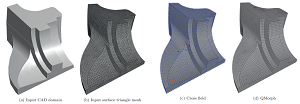<td>

**QMCF: QMorph Cross Field-driven Quad-dominant Meshing Algorithm**

Bertrand Pellenard, Gunay Orbay, James Chen, Shailendra Sohan, Wa Kwok, Joseph R. Tristano

2014, Procedia Engineering

[[doi]](https://doi.org/10.1016/j.proeng.2014.10.395)
<!-- ---------------------------------------------------------------------- -->
<tr><td><td>

**A frontal Delaunay quad mesh generator using the L ∞ norm**

J.-F. Remacle, F. Henrotte, T. Carrier-Baudouin, E. Béchet, E. Marchandise, C.  Geuzaine, T. Mouton

28 February 2013, IJNME

[[doi]](https://onlinelibrary.wiley.com/doi/abs/10.1002/nme.4458)
<!-- ---------------------------------------------------------------------- -->
<tr><td><td>

**Blossom-Quad: A non-uniform quadrilateral mesh generator using a minimum-cost perfect-matching algorithm**

J.-F. Remacle, J. Lambrechts, B. Seny, E. Marchandise, A. Johnen, C. Geuzainet

06 February 2012, CGF

[[doi]](https://onlinelibrary.wiley.com/doi/abs/10.1002/nme.3279) [[project]](https://www.math.uwaterloo.ca/~bico//blossom4/) [[code]](https://www.math.uwaterloo.ca/~bico//blossom4/match.tar.gz) [[code? (combined in RatRace)]](https://github.com/daniel-zint/RatRace)
<!-- ---------------------------------------------------------------------- -->
<tr><td><td>

**Direct quad-dominant meshing of point cloud via global parameterization**

Er Li, Wujun Che, Xiaopeng Zhang, Yi-Kuan Zhang, Bo Xu

June 2011, Computers & Graphics

[[doi]](https://doi.org/10.1016/j.cag.2011.03.021)
<!-- ---------------------------------------------------------------------- -->
<tr><td>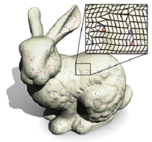<td>

**SQuad: Compact Representation for Triangle Meshes**

Topraj Gurung, Daniel Laney, Peter Lindstrom, Jarek Rossignac

28 April 2011, CGF

[[doi]](https://onlinelibrary.wiley.com/doi/abs/10.1111/j.1467-8659.2011.01866.x)
<!-- ---------------------------------------------------------------------- -->
<tr><td>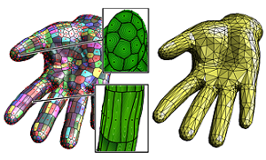<td>

**Lp Centroidal Voronoi Tessellation and its applications**

[Bruno Lévy], [Yang Liu]

26 July 2010, TOG

[[doi]](https://dl.acm.org/doi/abs/10.1145/1778765.1778856) [[code]](https://app.box.com/s/vh9mz9eody9xuxj7xtp2f19d8d7gya97):white_check_mark:
<!-- ---------------------------------------------------------------------- -->
<tr><td><td>

**Practical quad mesh simplification**

[Marco Tarini], [Nico Pietroni], [Paolo Cignoni], [Daniele Panozzo], [Enrico Puppo]

07 June 2010, CGF

[[doi]](https://onlinelibrary.wiley.com/doi/full/10.1111/j.1467-8659.2009.01610.x) [[implementation in MeshLab]](https://www.meshlab.net/)
<!-- ---------------------------------------------------------------------- -->
<tr><td><td>

**An incremental approach to feature aligned quad dominant remeshing**

**Feature aligned quad dominant remeshing using iterative local updates**

Yu-Kun Lai, [Leif Kobbelt], [Shi-Min Hu]

02 June 2008, SPM
February 2010, CAD

[[doi]](https://dl.acm.org/doi/abs/10.1145/1364901.1364921) [[doi]](https://doi.org/10.1016/j.cad.2009.02.017)
<!-- ---------------------------------------------------------------------- -->
<tr><td><td>

**4–8 Subdivision**

Luiz Velho, [Denis Zorin]

June 2001, CAGD

[[doi]](https://doi.org/10.1016/S0167-8396(01)00039-5) [[pdf]](https://cims.nyu.edu/gcl/papers/velho20014s.pdf)
<!-- ---------------------------------------------------------------------- -->
<tr><td><td>

**Quadrilateral Meshing with Directionality Control through the Packing of Square Cells**

Kenji Shimada, Jia-huei Liao, Takayuki Itoh

May 2000

[[doi]](https://www.researchgate.net/publication/2619142_Quadrilateral_Meshing_with_Directionality_Control_through_the_Packing_of_Square_Cells)
<!-- ---------------------------------------------------------------------- -->
<tr><td><td>

**Q-Morph: an indirect approach to advancing front quad meshing**

S. J. Owen, M. L. Staten, S. A. Canann, S. Saigal

17 March 1999, International Journal for Numerical Methods in Engineering

[[doi]](https://onlinelibrary.wiley.com/doi/abs/10.1002/(SICI)1097-0207(19990330)44:9%3C1317::AID-NME532%3E3.0.CO;2-N)
</table>

<!-- %%%%%%%%%%%%%%%%%%%%%%%%%%%%%%%%%%%%%%%%%%%%%%%%%%%%%%%%%%%%%%%%%%%%%%%%%%%%%%%%% -->
<!-- %%%%%%%%%%%%%%%%%%%%%%%%%%%%%%%%%%%%%%%%%%%%%%%%%%%%%%%%%%%%%%%%%%%%%%%%%%%%%%%%% -->
<!-- %%%%%%%%%%%%%%%%%%%%%%%%%%%%%%%%%%%%%%%%%%%%%%%%%%%%%%%%%%%%%%%%%%%%%%%%%%%%%%%%% -->
### :red_circle: Other techniques
<table> 
<!-- ---------------------------------------------------------------------- -->
<tr><td><td>

**Robust motorcycle graph construction and simplification for semi-structured quad mesh generation**

Yanchao Yu, Ni Li, Guanghong Gong

April 2025, Computers & Graphics

[[doi]](https://www.sciencedirect.com/science/article/pii/S0097849325000123)
<!-- ---------------------------------------------------------------------- -->
<tr><td><td>

**RFF-meshing: a parallel and anisotropic quad-dominant mesh generation framework based on Riemann frame field**

Long Qi, Jingying Qiu, [Gang Xu], Yang Liu, Jiamin Xu, Renshu Gu, Fengshun Lu, Yufei Pang

24 December 2024, Engineering with Computers

[[doi]](RFF-meshing-a-parallel-and-anisotropic-quad-dominant-mesh-generation-framework-based-on-Riemann-frame-field)
<!-- ---------------------------------------------------------------------- -->
<tr><td><td>

**Enhanced block-structured quadrilateral mesh generation: integrating cross-field and distance field for optimal domain decomposition**

Yuanxing Lv, Beiyan Jia, Yuxiang Yan, Cecil G. Armstrong, Trevor T. Robinson, Liang Sun

28 November 2024, Engineering with Computers

[[doi]](https://link.springer.com/article/10.1007/s00366-024-02084-x)
<!-- ---------------------------------------------------------------------- -->
<tr><td><td>

**Quad mesh mechanisms**

Caigui Jiang, Dmitry Lyakhov, Florian Rist, Helmut Pottmann, Johannes Wallner

19 November 2024, TOG

[[doi]](https://dl.acm.org/doi/10.1145/3687939)
<!-- ---------------------------------------------------------------------- -->
<tr><td><td>

**Similarity-driven topology finding of surface patterns for structural design**

R. Oval, R. Mesnil, T. Van Mele, O. Baverel, P. Block

November 2024, CAD

[[doi]](https://www.sciencedirect.com/science/article/pii/S0010448526540782)
<!-- ---------------------------------------------------------------------- -->
<tr><td>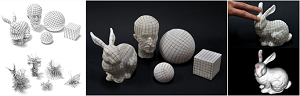<td>

**Capacitive Touch Sensing on General 3D Surfaces**

Gianpaolo Palma, Narges Pourjafarian, Jürgen Steimle, [Paolo Cignoni]

19 July 2024, TOG

[[doi]](https://dl.acm.org/doi/10.1145/3658185)
<!-- ---------------------------------------------------------------------- -->
<tr><td><td>

**An Intrinsic Vector Heat Network**

[Alexander Gao], Maurice Chu, Mubbasir Kapadia, [Ming C. Lin], [Hsueh-Ti Derek Liu]

18 July 2024, ICML

[[doi]](https://arxiv.org/abs/2406.09648) [[project]](https://www.alexandergao.com/vector-heat-network/) [[code]](https://github.com/gaoalexander/vector-heat-net/)
<!-- ---------------------------------------------------------------------- -->
<tr><td><td>

**High-quality quad-mesh generation for self-intersecting parametric surfaces**

Haolei Nan, [Gang Xu], Haiyan Wu, Renshu Gu, Jinlan Xu, [Yang Liu]

03 July 2024, Preprint

[[doi]](https://www.researchsquare.com/article/rs-4599197/v1)
<!-- ---------------------------------------------------------------------- -->
<tr><td><td>

**Feature-preserving quadrilateral mesh Boolean operation with cross-field guided layout blending**

Weiwei Zheng, Haiyan Wu, [Gang Xu], Ran Ling, Renshu Gu

June 2024, CAGD

[[doi]](https://www.sciencedirect.com/science/article/pii/S016783962654058X)
<!-- ---------------------------------------------------------------------- -->
<tr><td><td>

**Block-Structured Quad Meshing for Supersonic Flow Simulations**

Claire Roche, Jérôme Breil, Thierry Hocquellet, Franck Ledoux

21 March 2024, SIAM International Meshing Roundtable 2023

[[slide]](https://link.springer.com/chapter/10.1007/978-3-031-40594-5_7)
<!-- ---------------------------------------------------------------------- -->
<tr><td>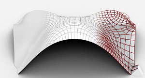<td>

**Bending-Reinforced Grid Shells for Free-form Architectural Surfaces**

Francesco Laccone, [Nico Pietroni], [Paolo Cignoni], Luigi Malomo

March 2024, CAD

[[doi]](https://www.sciencedirect.com/science/article/pii/S0010448523002026) [[dataset]](https://zenodo.org/records/10391043)
<!-- ---------------------------------------------------------------------- -->
<tr><td><td>

**Adaptive Spline Surface Fitting With Arbitrary Topological Control Mesh**

Yi-Bo Kou, Yi-Fei Feng, Li-Yong Shen, Xin Li, Chun-Ming Yuan

02 February 2024, TVCG (CVM 2025)

[[doi]](https://ieeexplore.ieee.org/abstract/document/10418985)
<!-- ---------------------------------------------------------------------- -->
<tr><td><td>

**Champs de repères 2,5D pour la génération de maillages hexaédriques**

Yoann Coudert

2024, Hal

[[doi]](https://hal.science/tel-04907393/)
<!-- ---------------------------------------------------------------------- -->
<tr><td><td>

**Optimal Surface Quadrilateral Mesh Generation**

Zhou Zhao, Siyu Fang, [Na Lei], Yuanpeng Liu, Yiming Zhu, Chander Sadasivan, Apostolos Tassiopoulos, Shikui Chen, [Xianfeng Gu]

2024, Proceedings of the 2024 International Meshing Roundtable (IMR)

[[doi]](https://epubs.siam.org/doi/abs/10.1137/1.9781611976541.2)
<!-- ---------------------------------------------------------------------- -->
<tr><td><td>

**QUADify: Extracting Meshes with Pixel-level Details and Materials from Images**

Maximilian Frühauf, Hayko Riemenschneider, Markus Gross, Christopher Schroers

2024, CVPR

[[doi]](https://openaccess.thecvf.com/content/CVPR2024/html/Fruhauf_QUADify_Extracting_Meshes_with_Pixel-level_Details_and_Materials_from_Images_CVPR_2024_paper.html)
<!-- ---------------------------------------------------------------------- -->
<tr><td><td>

**Quad Mesh Quantization Without a T-Mesh**

Yoann Coudert-Osmont, David Desobry, Martin Heistermann, [David Bommes], Nicolas Ray, Dmitry Sokolov

17 September 2023, CGF

[[doi]](https://onlinelibrary.wiley.com/doi/abs/10.1111/cgf.14928)
<!-- ---------------------------------------------------------------------- -->
<tr><td><td>

**Min-Deviation-Flow in Bi-directed Graphs for T-Mesh Quantization**

Martin Heistermann, Jethro Warnett, [David Bommes]

26 July 2023, TOG

[[doi]](https://dl.acm.org/doi/10.1145/3592437) [[project]](https://www.algohex.eu/publications/bimdf-quantization/) [[code]](https://github.com/cgg-bern/quadwild-bimdf):white_check_mark:
<!-- ---------------------------------------------------------------------- -->
<tr><td><td>

**Towards a robust and portable pipeline for quad meshing: Topological initialization of injective integer grid maps**

[Marco Livesu]

May 2023, CGF (Special Section on STAG 2022)

[[doi]](https://www.sciencedirect.com/science/article/pii/S0097849323000341) [[code]](https://github.com/mlivesu/topological_IGM/tree/master)
<!-- ---------------------------------------------------------------------- -->
<tr><td><td>

**What's the Situation With Intelligent Mesh Generation: A Survey and Perspectives**

[Na Lei], Zezeng Li, Zebin Xu, Ying Li, [Xianfeng Gu]

01 June 2023, TVCG

[[doi]](https://ieeexplore.ieee.org/abstract/document/10141677)
<!-- ---------------------------------------------------------------------- -->
<tr><td><td>

**Face Extrusion Quad Meshes**

Karran Pandey, J. Andreas Bærentzen, Karan Singh

24 July 2022, SIGGRAPH 2022

[[doi]](https://dl.acm.org/doi/abs/10.1145/3528233.3530754) [[project]](https://www.dgp.toronto.edu/projects/feq/)
<!-- ---------------------------------------------------------------------- -->
<tr><td><td>

**Learning Direction Fields for Quad Mesh Generation**

Alexander Dielen, Isaak Lim, [Max Lyon], [Leif Kobbelt]

23 August 2021, CGF

[[doi]](https://onlinelibrary.wiley.com/doi/abs/10.1111/cgf.14366) [[project]](https://www.graphics.rwth-aachen.de/publication/03337/)
<!-- ---------------------------------------------------------------------- -->
<tr><td><td>

**Simpler Quad Layouts using Relaxed Singularities**

[M. Lyon], [M. Campen], [L. Kobbelt]

23 August 2021, CGF

[[doi]](https://onlinelibrary.wiley.com/doi/full/10.1111/cgf.14365) [[project]](https://www.graphics.rwth-aachen.de/publication/03336/)
<!-- ---------------------------------------------------------------------- -->
<tr><td><td>

**A parallel dual marching cubes approach to quad only surface reconstruction**

Roberto Grosso, [Daniel Zint]

06 June 2021, The Visual Computer

[[doi]](https://link.springer.com/article/10.1007/s00371-021-02139-w)
<!-- ---------------------------------------------------------------------- -->
<tr><td>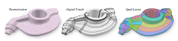<td>

**Quad Layouts via Constrained T-Mesh Quantization**

[M. Lyon], [M. Campen], [L. Kobbelt]

04 June 2021, CGF

[[doi]](https://onlinelibrary.wiley.com/doi/full/10.1111/cgf.142634) [[project]](https://www.graphics.rwth-aachen.de/publication/03330/)
<!-- ---------------------------------------------------------------------- -->
<tr><td><td>

**Semi-global Quad Mesh Structure Simplification via Separatrix Operations**

Kaoji Xu, Muhammad Naeem Akram, Guoning Chen

17 November 2020 (SIGGRAPH Asia 2020 Technical Communications)

[[doi]](https://dl.acm.org/doi/10.1145/3410700.3425436)
<!-- ---------------------------------------------------------------------- -->
<tr><td><td>

**Low degree splines for locally quad-dominant meshes**

Kȩstutis Karčiauskas, Jörg Peters

November 2020, CAGD

[[doi]](https://doi.org/10.1016/j.cagd.2020.101934)
<!-- ---------------------------------------------------------------------- -->
<tr><td><td>

**Cost Minimizing Local Anisotropic Quad Mesh Refinement**

[Max Lyon], [David Bommes], and [Leif Kobbelt]

12 August 2020, CGF

[[doi]](https://onlinelibrary.wiley.com/doi/full/10.1111/cgf.14076) [[video]](https://www.graphics.rwth-aachen.de/publication/03311/)
<!-- ---------------------------------------------------------------------- -->
<tr><td><td>

**QuadMixer: layout preserving blending of quadrilateral meshes**

[Stefano Nuvoli], Alex Hernandez, Claudio Esperança, [Riccardo Scateni], [Paolo Cignoni], [Nico Pietroni]

08 November 2019, TOG (SIGGRAPH Asia 2019)

[[doi]](https://dl.acm.org/doi/10.1145/3355089.3356542) [[code]](https://github.com/stefanonuvoli/quadmixer):white_check_mark:
<!-- ---------------------------------------------------------------------- -->
<tr><td><td>

**Parametrization quantization with free boundaries for trimmed quad meshing**

[Max Lyon], [Marcel Campen], [David Bommes], [Leif Kobbelt]

12 July 2019, TOG (SIGGRAPH 2019)

[[doi]](https://dl.acm.org/doi/10.1145/3306346.3323019)
<!-- ---------------------------------------------------------------------- -->
<tr><td><td>

**Towards fully regular quad mesh generation**

Julia Docampo-Sanchez, Robert Haimes

06 Jan 2019, AIAA

[[doi]](https://arc.aiaa.org/doi/abs/10.2514/6.2019-1988)
<!-- ---------------------------------------------------------------------- -->
<tr><td><td>

**QuadriFlow: A Scalable and Robust Method for Quadrangulation**

Jingwei Huang, Yichao Zhou, Matthias Niessner, Jonathan Richard Shewchuk, Leonidas J. Guibas

08 August 2018, CGF

[[doi]](https://onlinelibrary.wiley.com/doi/abs/10.1111/cgf.13498) [[code]](https://github.com/hjwdzh/QuadriFlow):white_check_mark:
<!-- ---------------------------------------------------------------------- -->
<tr><td><td>

**Partitioning Surfaces Into Quadrilateral Patches: A Survey**

[M. Campen]

04 May 2017, CGF

[[doi]](https://onlinelibrary.wiley.com/doi/abs/10.1111/cgf.13153)
<!-- ---------------------------------------------------------------------- -->
<tr><td><td>

**All-quad meshing without cleanup**

Ahmad A. Rushdi, Scott A. Mitchell, Ahmed H. Mahmoud, Chandrajit C. Bajaj, Mohamed S. Ebeida

April 2017, CAD

[[doi]](https://www.sciencedirect.com/science/article/pii/S001044851630080X)
<!-- ---------------------------------------------------------------------- -->
<tr><td><td>

**Interactively controlled quad remeshing of high resolution 3D models**

[Hans-Christian Ebke], [Patrick Schmidt], [Marcel Campen], [Leif Kobbelt]

05 December 2016, TOG

[[doi]](https://dl.acm.org/doi/10.1145/2980179.2982413)
<!-- ---------------------------------------------------------------------- -->
<tr><td><td>

**A PDE Based Approach to Multidomain Partitioning and Quadrilateral Meshing**

Nicolas Kowalski, Franck Ledoux, Pascal Frey

26 Feb 2016, Proceedings of the 21st International Meshing Roundtable

[[doi]](https://link.springer.com/chapter/10.1007/978-3-642-33573-0_9)
<!-- ---------------------------------------------------------------------- -->
<tr><td><td>

**Instant field-aligned meshes**

Wenzel Jakob, [Marco Tarini], [Daniele Panozzo], [Olga Sorkine-Hornung]

02 November 2015, TOG (SIGGRAPH ASIA 2015, Outstanding Software Award at SGP 2020)

[[doi]](https://dl.acm.org/doi/10.1145/2816795.2818078) [[project]](https://igl.ethz.ch/projects/instant-meshes/) [[code]](https://github.com/wjakob/instant-meshes):white_check_mark:
<!-- ---------------------------------------------------------------------- -->
<tr><td><td>

**Quantized global parametrization**

[Marcel Campen], [David Bommes], [Leif Kobbelt]

02 November 2015, TOG

[[doi]](https://dl.acm.org/doi/abs/10.1145/2816795.2818140)
<!-- ---------------------------------------------------------------------- -->
<tr><td><td>

**Data-Driven Interactive Quadrangulation**

Giorgio Marcias, [Kenshi Takayama], [Nico Pietroni], [Daniele Panozzo], [Olga Sorkine-Hornung], [Enrico Puppo], [Paolo Cignoni]

27 July 2015, TOG (SIGGRAPH North America 2015)

[[doi]](https://dl.acm.org/doi/abs/10.1145/2766964) [[project]](https://vcg.isti.cnr.it/publication/2015/MTPPSPC15/) [[code]](http://igl.ethz.ch/projects/sketch-retopo/sketch-retopo-license.html) [[video]](https://youtu.be/H8K5CyQB_kc)
<!-- ---------------------------------------------------------------------- -->
<tr><td><td>

**Level-of-detail quad meshing**

[Hans-Christian Ebke], [Marcel Campen], [David Bommes], [Leif Kobbelt]

19 November 2014, TOG

[[doi]](https://dl.acm.org/doi/abs/10.1145/2661229.2661240)
<!-- ---------------------------------------------------------------------- -->
<tr><td>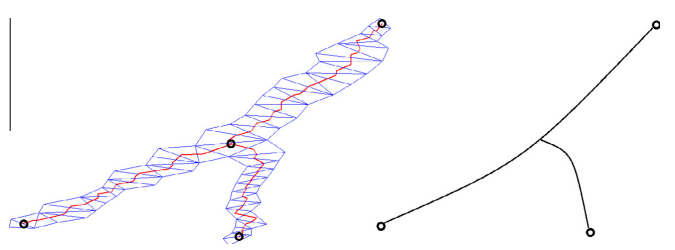<td>

**Using the medial axis to represent flow features for feature-aligned unstructured quad-dominant mesh generation**

M.J. Harris, N. Qin

10 October 2014, Computers & Fluids

[[doi]](https://doi.org/10.1016/j.compfluid.2014.06.017)
<!-- ---------------------------------------------------------------------- -->
<tr><td><td>

**Designing N-PolyVector Fields with Complex Polynomials**

Olga Diamanti, [Amir Vaxman], [Daniele Panozzo], [Olga Sorkine-Hornung]

23 August 2014, CGF

[[doi]](https://onlinelibrary.wiley.com/doi/abs/10.1111/cgf.12426) [[project]](https://igl.ethz.ch/projects/complex-roots/) [[code]](https://igl.ethz.ch/projects/complex-roots/nPV.zip)
<!-- ---------------------------------------------------------------------- -->
<tr><td><td>

**An effective quad-dominant meshing method for unorganized point clouds**

Xufang Pang, Zhan Song, Rynson W.H. Lau

March 2014, Graphical Models

[[doi]](https://doi.org/10.1016/j.gmod.2013.11.004)
<!-- ---------------------------------------------------------------------- -->
<tr><td><td>

**QEx: robust quad mesh extraction**

[Hans-Christian Ebke], [David Bommes], [Marcel Campen], [Leif Kobbelt]

01 November 2013, TOG

[[doi]](https://dl.acm.org/doi/abs/10.1145/2508363.2508372) [[code]](https://github.com/hcebke/libQEx):white_check_mark:
<!-- ---------------------------------------------------------------------- -->
<tr><td><td>

**Animation-Aware Quadrangulation**

Giorgio Marcias, [Nico Pietroni], [Daniele Panozzo], [Enrico Puppo], [Olga Sorkine-Hornung]

19 August 2013, CGF (SGP 13)

[[doi]](https://onlinelibrary.wiley.com/doi/abs/10.1111/cgf.12183) [[project]](https://igl.ethz.ch/projects/animation-aware-quadrangulation/)
<!-- ---------------------------------------------------------------------- -->
<tr><td>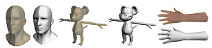<td>

**Sketch-based generation and editing of quad meshes**

[Kenshi Takayama], [Daniele Panozzo], [Alexander Sorkine-Hornung], [Olga Sorkine-Hornung]

21 July 2013, TOG (SIGGRAPH North America 2013)

[[doi]](https://dl.acm.org/doi/abs/10.1145/2461912.2461955) [[project]](https://igl.ethz.ch/projects/sketch-retopo/) [[code]](http://igl.ethz.ch/projects/sketch-retopo/sketch-retopo-license.html) [[slide]](https://kenshi84.github.io/sketch-retopo/sketch-retopo.pptx) [[video]](https://youtu.be/-OTl_TtAm1o)
<!-- ---------------------------------------------------------------------- -->
<tr><td>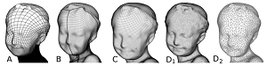<td>

**Quad-Mesh Generation and Processing: A Survey**

[David Bommes], [Bruno Lévy], [Nico Pietroni], [Enrico Puppo], [Claudio Silva], [Marco Tarini], [Denis Zorin]

01 January 2012, CGF (Eurographics 2012-State of the Art Reports)

[[doi]](https://dl.acm.org/doi/abs/10.1111/cgf.12014)
<!-- ---------------------------------------------------------------------- -->
<tr><td><td>

**Implicit Hierarchical Quad-Dominant Meshes**

[Daniele Panozzo], [Enrico Puppo]

02 February 2011, CGF

[[doi]](https://doi.org/10.1111/j.1467-8659.2011.01847.x) [[pdf]](https://cims.nyu.edu/gcl/papers/CGF2011-PanPup.pdf)
<!-- ---------------------------------------------------------------------- -->
<tr><td><td>

**Designing Quad-dominant Meshes with Planar Faces**

Mirko Zadravec, Alexander Schiftner, Johannes Wallner

21 September 2010, CGF

[[doi]](https://doi.org/10.1111/j.1467-8659.2010.01776.x) [[pdf]](https://www.geometrie.tuwien.ac.at/geom/ig/publications/oldpub/2010/design10/paper_doc/design.pdf)
<!-- ---------------------------------------------------------------------- -->
<tr><td>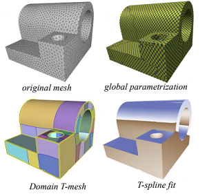<td>

**Feature-aligned T-meshes**

Ashish Myles, [Nico Pietroni], Denis Kovacs, [Denis Zorin]

26 July 2010, TOG

[[doi]](https://dl.acm.org/doi/abs/10.1145/1778765.1778854)
<!-- ---------------------------------------------------------------------- -->
<tr><td><td>

**Mixed-integer quadrangulation**

[David Bommes], Henrik Zimmer, [Leif Kobbelt]

27 July 2009, TOG

[[doi]](https://dl.acm.org/doi/abs/10.1145/1531326.1531383) [[additional material]](https://www-sop.inria.fr/members/David.Bommes/publications/miq.zip) [[implementation (libigl)]](https://github.com/libigl/libigl/tree/main):x: [[implementation (manolas/vcglib/wrap/igl)]](https://gitea-s2i2s.isti.cnr.it/manolas/vcglib/src/branch/devel/wrap) [[tutorial (libigl)]](https://libigl.github.io/tutorial/)
<!-- ---------------------------------------------------------------------- -->
<tr><td>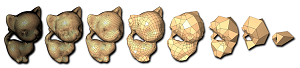<td>

**Quadrilateral mesh simplification**

Joel Daniels, Cláudio T. Silva, Jason Shepherd, Elaine Cohen

01 December 2008, TOG

[[doi]](https://dl.acm.org/doi/abs/10.1145/1409060.1409101)
<!-- ---------------------------------------------------------------------- -->
<tr><td><td>

**QuadCover - Surface Parameterization using Branched Coverings**

Felix Kälberer, Matthias Nieser, Konrad Polthier

12 October 2007, CGF

[[doi]](https://onlinelibrary.wiley.com/doi/abs/10.1111/j.1467-8659.6547.01060.x)
<!-- ---------------------------------------------------------------------- -->
<tr><td>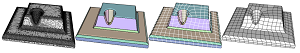<td>

**A Robust Two-Step Procedure for Quad-Dominant Remeshing**

[Martin Marinov], [Leif Kobbelt]

07 December 2006, CGF

[[doi]](https://doi.org/10.1111/j.1467-8659.2006.00973.x) [[project]](https://www.graphics.rwth-aachen.de/publication/0379/) [[data]](https://graphics.rwth-aachen.de/media/papers/meshes.zip)
<!-- ---------------------------------------------------------------------- -->
<tr><td><td>

**Adaptive and quality quadrilateral/hexahedral meshing from volumetric data**

Yongjie Zhang, Chandrajit Bajaj

01 February 2006, CMAME

[[doi]](https://www.sciencedirect.com/science/article/pii/S0045782505001374)
<!-- ---------------------------------------------------------------------- -->
<tr><td><td>

**Direct anisotropic quad-dominant remeshing**

M. Marinov, [L. Kobbelt]

01 November 2004, PG

[[doi]](https://ieeexplore.ieee.org/abstract/document/1348351)
<!-- ---------------------------------------------------------------------- -->
</table>

<!-- %%%%%%%%%%%%%%%%%%%%%%%%%%%%%%%%%%%%%%%%%%%%%%%%%%%%%%%%%%%%%%%%%%%%%%%%%%%%%%%%% -->
<!-- %%%%%%%%%%%%%%%%%%%%%%%%%%%%%%%%%%%%%%%%%%%%%%%%%%%%%%%%%%%%%%%%%%%%%%%%%%%%%%%%% -->
<!-- %%%%%%%%%%%%%%%%%%%%%%%%%%%%%%%%%%%%%%%%%%%%%%%%%%%%%%%%%%%%%%%%%%%%%%%%%%%%%%%%% -->
## N-sided patch
<table>
<!-- ---------------------------------------------------------------------- -->
<tr><td><td>

**Closed-form Quadrangulation of n-Sided Patches**

[Marco Tarini]

October 2022, Computers & Graphics

[[doi]](https://www.sciencedirect.com/science/article/pii/S0097849322001170) [[demo]](https://tarini.di.unimi.it/cc-ability.html):white_check_mark:
<!-- ---------------------------------------------------------------------- -->
<tr><td><td>

**Pattern-Based Quadrangulation for N-Sided Patches**

[Kenshi Takayama], [Daniele Panozzo], [Olga Sorkine-Hornung]

23 August 2014, CGF (SGP 14)

[[doi]](https://onlinelibrary.wiley.com/doi/epdf/10.1111/cgf.12443) [[project]](https://igl.ethz.ch/projects/patch-quad/) [[code]](https://kenshi84.github.io/patch-quad/patch-quad.zip) [[slide]](https://kenshi84.github.io/patch-quad/patch-quad.pptx) [[video]](https://www.youtube.com/watch?v=qtvPb7ZeIp4)
<!-- ---------------------------------------------------------------------- -->
<tr><td><td>

**Robust and Controllable Quadrangulation of Triangular and Rectangular Regions**

[Kenshi Takayama], [Daniele Panozzo], [Alexander Sorkine-Hornung], [Olga Sorkine-Hornung]

2013, Technical Report

[[doi]](https://www.research-collection.ethz.ch/handle/20.500.11850/67168)
<!-- ---------------------------------------------------------------------- -->
<tr><td><td>

**Filling N-Sided Regions by Quad Meshes for Subdivision Surfaces**

A. Nasri, M. Sabin, Z. Yasseen

16 September 2009, CGF

[[doi]](https://onlinelibrary.wiley.com/doi/abs/10.1111/j.1467-8659.2009.01417.x)
<!-- ---------------------------------------------------------------------- -->
</table>

<!-- %%%%%%%%%%%%%%%%%%%%%%%%%%%%%%%%%%%%%%%%%%%%%%%%%%%%%%%%%%%%%%%%%%%%%%%%%%%%%%%%% -->
<!-- %%%%%%%%%%%%%%%%%%%%%%%%%%%%%%%%%%%%%%%%%%%%%%%%%%%%%%%%%%%%%%%%%%%%%%%%%%%%%%%%% -->
<!-- %%%%%%%%%%%%%%%%%%%%%%%%%%%%%%%%%%%%%%%%%%%%%%%%%%%%%%%%%%%%%%%%%%%%%%%%%%%%%%%%% -->

## High-order
You can refer to [high-order-meshing-survey](https://github.com/Bigger-and-Stronger/high-order-meshing-survey).

# :hammer: Other Projects

- CGAL (IGM Quad Meshing) [[doc]](https://cgal.geometryfactory.com/products/Quad_meshing/4.12/Quad_meshing/index.html)
- CoMiSo [[project]](https://www.graphics.rwth-aachen.de/software/comiso/):white_check_mark:
- HOHQMesh [[code]](https://github.com/trixi-framework/HOHQMesh):white_check_mark:
- RatRace [[code]](https://github.com/daniel-zint/RatRace)
- TinyAD [[code]](https://github.com/patr-schm/TinyAD)

# :floppy_disk: Softwares

[Alexander Gao]: https://www.alexandergao.com/
[Alexander Sorkine-Hornung]: https://www.sornlex.com/
[Amir Vaxman]: https://avaxman.github.io
[Bruno Lévy]: https://brunolevy.github.io/
[Claudio Silva]: https://engineering.nyu.edu/faculty/claudio-silva
[Daniel Zint]: https://daniel-zint.github.io/
[Daniele Panozzo]: https://cims.nyu.edu/gcl/daniele.html
[David Bommes]: https://www.graphics.rwth-aachen.de/person/6/
[Denis Zorin]: https://cims.nyu.edu/gcl/denis.html
[Dong-Ming Yan]: https://people.ucas.ac.cn/~dmyan
[Enrico Puppo]: https://person.dibris.unige.it/puppo-enrico/
[Gang Xu]: https://faculty.hdu.edu.cn/jsjxy/xg/main.htm
[Hans-Christian Ebke]: https://www.graphics.rwth-aachen.de/person/10/
[Hsueh-Ti Derek Liu]: https://www.dgp.toronto.edu/~hsuehtil/
[Hujun Bao]: http://www.cad.zju.edu.cn/home/bao/
[Kenshi Takayama]: https://kenshi84.github.io/
[Leif Kobbelt]: https://www.graphics.rwth-aachen.de/person/3/
[L. Kobbelt]: https://www.graphics.rwth-aachen.de/person/3/
[Jin Huang]: http://www.cad.zju.edu.cn/home/hj/index.xml
[Marcel Campen]: https://graphics.cs.uos.de/
[M. Campen]: https://graphics.cs.uos.de/
[Marco Livesu]: http://pers.ge.imati.cnr.it/livesu/
[Marco Tarini]: https://tarini.di.unimi.it/
[Martin Marinov]: https://www.graphics.rwth-aachen.de/person/43/
[Max Lyon]: https://www.graphics.rwth-aachen.de/person/99/
[M. Lyon]: https://www.graphics.rwth-aachen.de/person/99/
[Maxence Reberol]: https://mxncr.github.io
[Ming C. Lin]: https://www.cs.umd.edu/~lin/
[Na Lei]: http://conformalgeometry.org/~lei/
[Nico Pietroni]: https://www.nicopietroni.com/
[Nico Schertler]: https://nschertler.github.io/
[Olga Sorkine-Hornung]: https://igl.ethz.ch/people/sorkine/
[Paolo Cignoni]: https://vcg.isti.cnr.it/~cignoni/
[Patrick Schmidt]: https://patr-schm.github.io/
[Riccardo Scateni]: https://web.unica.it/unica/page/it/riccardo_scateni
[Shi-Min Hu]: https://cg.cs.tsinghua.edu.cn/shimin.htm
[Stefano Nuvoli]: https://github.com/stefanonuvoli
[Wenping Wang]: https://engineering.tamu.edu/cse/profiles/Wang-Wenping.html
[Xianfeng Gu]: https://www3.cs.stonybrook.edu/~gu/
[Xianzhong Fang]: https://xzfang.top/
[Xingyi Du]: https://duxingyi-charles.github.io/
[Yang Liu]: https://xueyuhanlang.github.io/

